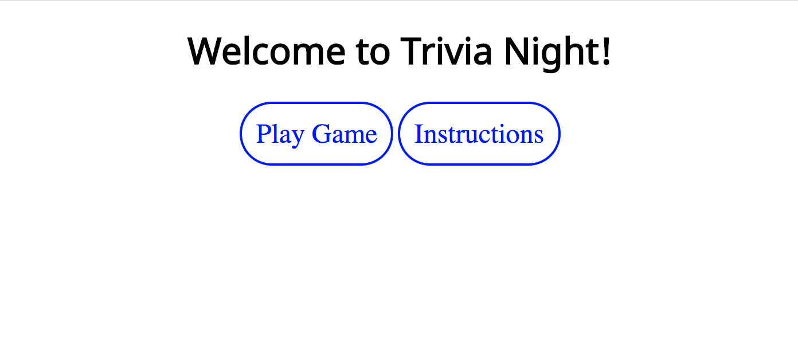
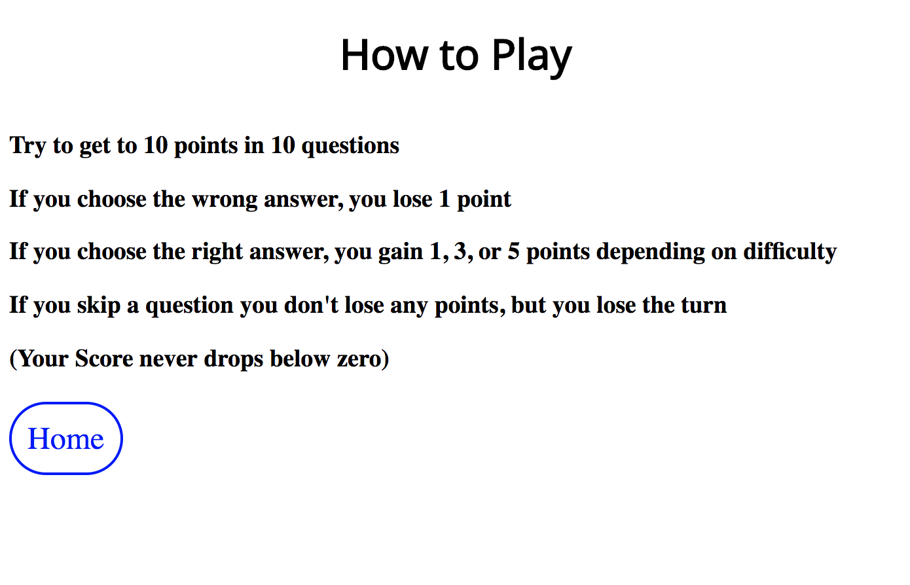
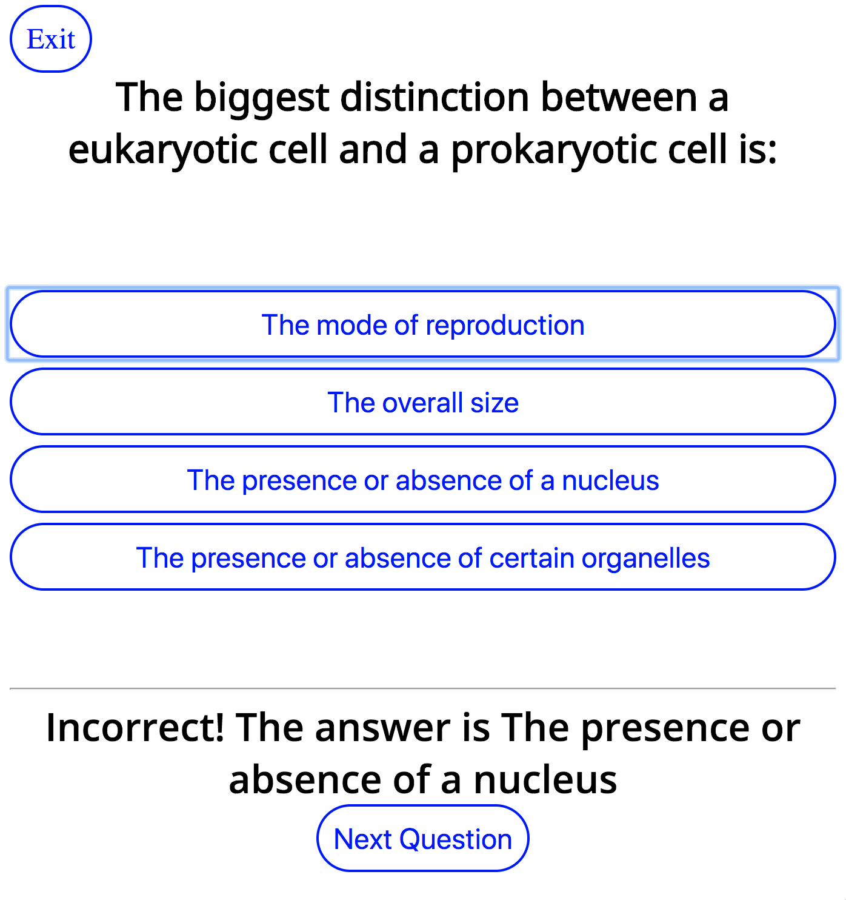
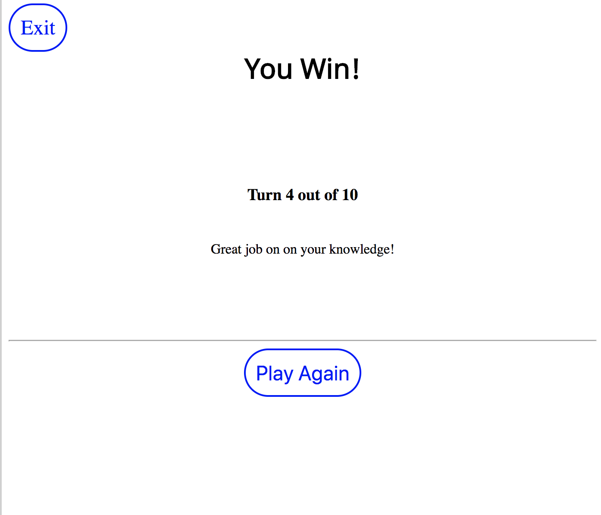
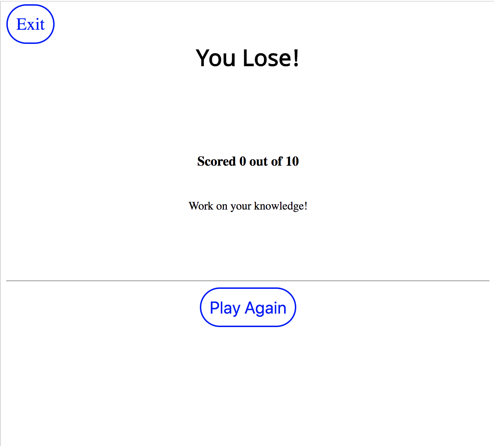

# Trivial Games

### Setup and Configuration
Trivial Games is a simple trivia app for entertaining oneself, one's family and friends with mildy amusing trivia questions

Ruby 2.4.3 on Rails 5.2.2

```shell
git clone https://github.com/geoffreyadebonojo/trivial_games.git
cd trivial_games
bundle
```

Even though this app doesn't use a database, we still need to create one and run a migration with
```shell
rake db:{create,migrate}
```

To run the test suite,
```shell
rspec
```
Simplecov coverage available:
```shell
open coverage/index.html
```

To run locally:
```shell
rails s
```

This project is deployed on Heroku: https://lit-lowlands-39159.herokuapp.com/

The project repository is on GitHub: https://github.com/geoffreyadebonojo/trivial_games

With Continuous Integration by Travis CI

Trivial Games consumes the Open Trivia DB API for its questions

# Gameplay
### Trivia Night plays like a trivia quiz, where a single player or group of players one round to answer as many questions as they can.

Players begin at the Home screen where they can choose to begin playing the game


Or to see rules on how to play.



There are two types of questions:

Multiple Choice


True-False


Both are weighted the same in terms of scoring. Score is determined by a card's 'difficulty' as determined by the api:

```
{ "category"=>"Entertainment: Video Games",
  "type"=>"multiple",
  "difficulty"=>"hard",
  "question"=>"Which car did not appear in the 2002 Lego Game: Drome Racers?",
  "correct_answer"=>"Wasp",
  "incorrect_answers"=>["Raptor", "Hornet", "Behemoth"]
}
```

Easy questions are worth 1 point, Medium questions are worth 3 points and Difficult questions are worth 5 points.

Answers are given as soon as the user clicks an answer button:


The scorekeeping for this game is done in localStorage, by setting two variables, "score" and "questionNum".

### The goal of the game is to reach 10 points before 10 questions have been asked.

If the player or team of players reaches a score of 10 before 10 questions have been asked:


Otherwise, if the player or team of players does not reach a score of 10 before 10 questions have been asked:

