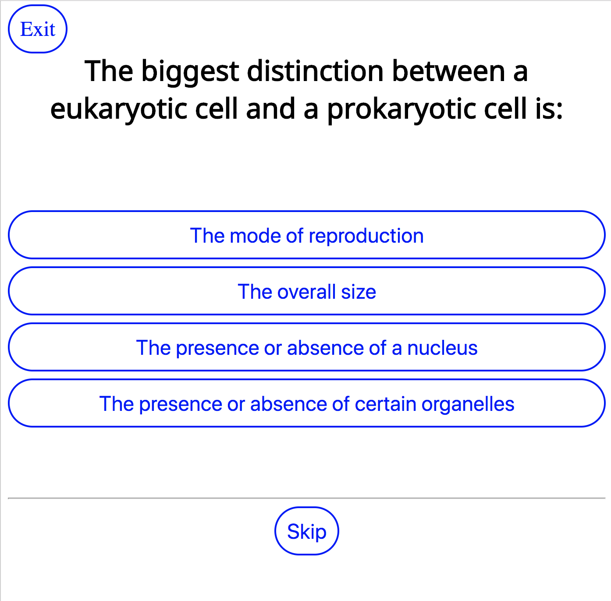
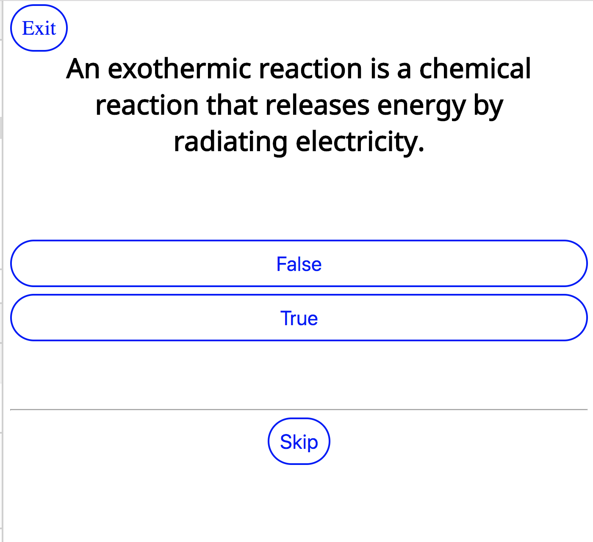

# README

Trivial Games is a trivia app


Ruby 2.4.3 on Rails 5.2.2

```shell
git clone https://github.com/geoffreyadebonojo/trivial_games.git
cd trivial_games
bundle
```

Even though this app doesn't use a database, we still need to create one and run a migration with
```shell
rake db:{create,migrate}
```

To run the test suite,
```shell
rspec
```
Simplecov coverage available:
```shell
open coverage/index.html
```

To run locally:
```shell
rails s
```


Multiple Choice


True-False

